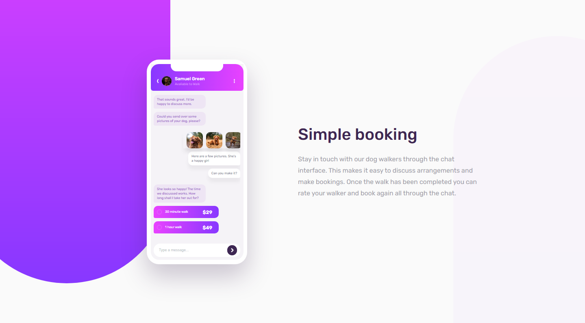

## Usage

- Live version at: https://chat-app-liart.vercel.app/
- Enter text into the input box and press enter to see new messages.
- Resize page to test responsiveness.
- Refresh to check out animations.

## Introduction

Challenge by Frontend Mentor: https://www.frontendmentor.io/challenges/chat-app-css-illustration-O5auMkFqY

A front end challenge to add to my portfolio and also keep my skills fresh.

What makes my soloution unique to other solution submitted is that I have not created a static mobile section. I pass in mock data to the 'Phone Content' component which then creates the messages using a reusable 'Message' component that will change depending on the message type supplied. I wanted to do it this way as it was more realistic to a real mobile design implementation and would be more of a challenge.

Overall it was very enjoyable to implement and I did learn a few new tricks.
